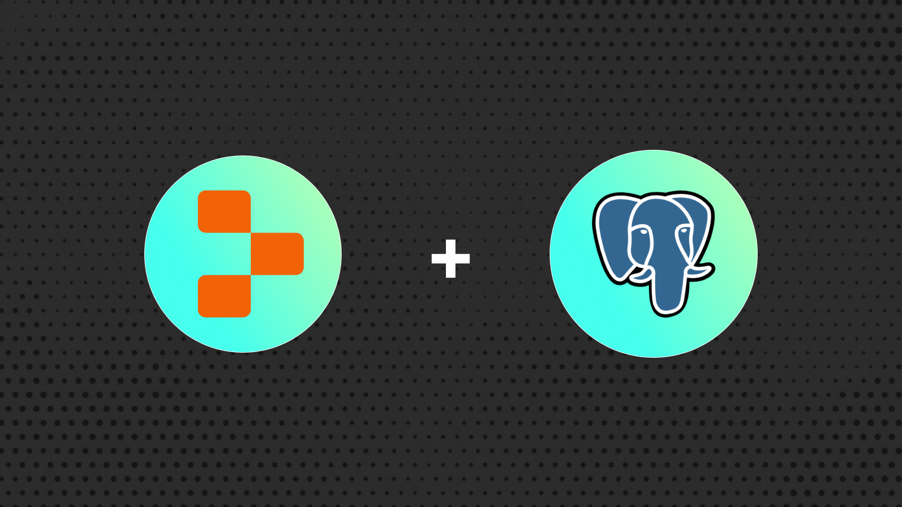
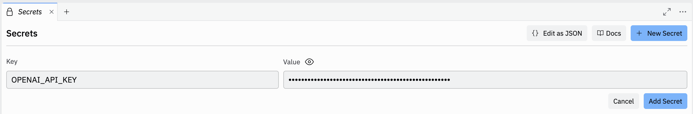
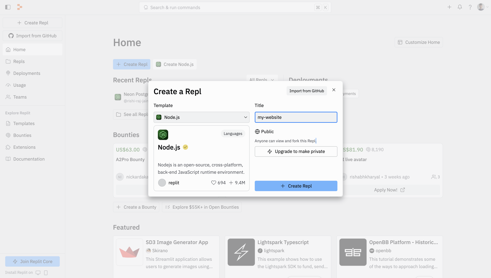
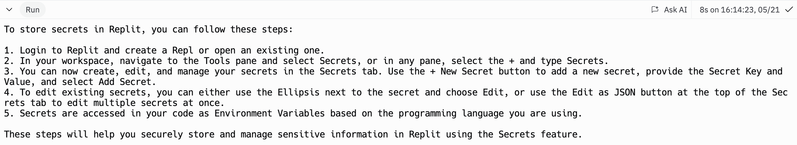

# Build an AI Chatbot for any website using Replit Postgres and OpenAI

Step-by-step guide to build an AI chatbot for any website in Replit with OpenAI.



This guide covers a step-by-step process of building an AI chatbot for any website in Replit using their latest Postgres offering, and OpenAI. Let's get started.

## Prerequisites

To follow along this guide, you will need the following:

- An [OpenAI](https://platform.openai.com) account
- A [Replit](https://replit.com) account

## Steps

- [Generate OpenAI API Token](#generate-openai-api-token)
- [Create a new Replit project](#create-a-new-replit-project)
- [Provisioning a Serverless Postgres (powered by Neon) in Replit](#provisioning-a-serverless-postgres-powered-by-neon-in-replit)
- [Create OpenAI API Embeddings Client](#create-openai-api-embeddings-client)
- [Create a Postgres Vector Store with pgvector](#create-a-postgres-vector-store-with-pgvector)
- [Using sitemap.xml to scrape content on a website](#using-sitemapxml-to-scrape-content-on-a-website)
- [Question the trained AI Chatbot](#question-the-trained-ai-chatbot)
- [Configure the Repl entrypoint](#configure-the-repl-entrypoint)

## Generate OpenAI API Token

HTTP requests to the OpenAI API require an authorization token. To generate this token, while logged into your OpenAI account, navigate to the [API Keys](https://platform.openai.com/api-keys) page and click the **Create new secret key** button after entering name for your token. Copy and securely store this token as Replit Secret for later use as `OPENAI_API_KEY` environment variable.



## Create a new Replit project

Let’s get started by creating a new Replit project. Navigate to your [Replit Dashboard](https://replit.com/~) and click **+ Create Repl** to start creating a new project. Select **Node.js** as the template, and give a personalized **Title** to your project.



Once that's done, execute the following command in [a Replit Shell](https://ask.replit.com/t/where-we-can-find-terminal/111420/2) to install the necessary libraries and packages for building the application:

```bash
npm install @neondatabase/serverless langchain@0.1.37 @langchain/community@0.0.56 @langchain/openai@0.0.28
npm install -D @types/node cheerio xmldom
```

The above command installs the packages passed to the install command, with the -D flag specifying the libraries intended for development purposes only.

The libraries installed include:

- `@neondatabase/serverless`: Neon's PostgreSQL driver for JavaScript and TypeScript.
- `langchain`: A framework for developing applications powered by language models.
- `@langchain/community`: A collection of third party integrations for plug-n-play with LangChain core.
- `@langchain/openai`: A LangChain package to interface with the OpenAI series of models.

The development-specific libraries include:

- `@types/node`: Type definitions for node.
- `cheerio`: A library for parsing and manipulating HTML and XML.
- `xmldom`: A pure JavaScript W3C standard-based `DOMParser` and `XMLSerializer` module.

Now, let's move on to spinning up a Postgres database in Replit.

## Provisioning a Serverless Postgres (powered by Neon) in Replit

1. Open a new tab in Replit and type **PostgreSQL**


2. In the **PostgreSQL** panel, click **create a database**


3. In the env section, you can view all of the relevant connection information about your database.


Now, let's move on to creating a client for generating vector embeddings via Open AI API.

## Create OpenAI API Embeddings Client

Through the `@langchain/openai` package, you are able to obtain vector embeddings for text via OpenAI API. The `OpenAIEmbeddings` class, when integrated with any LangChain Vector Store, simplifies the process of generating and inserting vector embeddings. Create a file named **vectorStore.js**, and with the following code in it, initialize the `OpenAIEmbeddings` class to easily generate vector embeddings under the hood.

```tsx
// File: vectorStore.js

const { OpenAIEmbeddings } = require("@langchain/openai");

// Initialize an embeddings instance
const embeddings = new OpenAIEmbeddings({
  model: "text-embedding-3-small",
  apiKey: process.env.OPENAI_API_KEY,
});
```

Now, let's move on to integrating Replit Postgres (with pgvector) as the vector store for the generated vector embeddings.

## Create a Postgres Vector Store with pgvector

Using `NeonPostgres` module, you are able to create a connectionless client that allows you to store, delete, and query vector embeddings from your Replit Postgres index.

```diff
// File: vectorStore.js

const { OpenAIEmbeddings } = require("@langchain/openai");
+ const { NeonPostgres } = require("@langchain/community/vectorstores/neon");

// Initialize an embeddings instance
const embeddings = new OpenAIEmbeddings({
  model: "text-embedding-3-small",
  apiKey: process.env.OPENAI_API_KEY,
});

+ // Initialize a NeonPostgres instance to store embedding vectors
+ exports.loadVectorStore = async () => {
+   return await NeonPostgres.initialize(embeddings, {
+     connectionString: `postgresql://${process.env.PGUSER}:${process.env.PGPASSWORD}@${process.env.PGHOST}/${process.env.PGDATABASE}?sslmode=require`,
+   });
+ };
```

Now, let's move on to creating a function to generate vector embeddings of contents in a website.

## Using sitemap.xml to scrape content on a website

To locate all the content routes in a website, you are going to rely on the contents of `/sitemap.xml` route. Using `xmldom` you can parse the `sitemap.xml` file, and then fetch contents of each route, and create vector embeddings from it's content.

First, let's create a file named `train.js` with the following code:

```tsx
// File: train.js

const { loadVectorStore } = require("./vectorStore");
const {
  CheerioWebBaseLoader,
} = require("langchain/document_loaders/web/cheerio");
const { RecursiveCharacterTextSplitter } = require("langchain/text_splitter");
const { neon } = require("@neondatabase/serverless");

const sql = neon(
  `postgresql://${process.env.PGUSER}:${process.env.PGPASSWORD}@${process.env.PGHOST}/${process.env.PGDATABASE}?sslmode=require`,
);

exports.train = async (dataUrls) => {
  // Ensure the trained_urls table exists
  await sql(
    `CREATE TABLE IF NOT EXISTS trained_urls (url TEXT UNIQUE NOT NULL)`,
  );
  const trainingResult = [];
  // Initialize a NeonPostgres instance to store embedding vectors
  const vectorStore = await loadVectorStore();
  try {
    const executeAsyncOperation = (element) => {
      return new Promise(async (resolve) => {
        try {
          const result = await sql(
            `SELECT COUNT(*) FROM trained_urls WHERE url = $1`,
            [element],
          );
          if (result[0].count > 0) return resolve();
          // Load LangChain's Cheerio Loader to parse the webpage
          const loader = new CheerioWebBaseLoader(element);
          const data = await loader.load();
          // Split the page into biggest chunks
          const textSplitter = new RecursiveCharacterTextSplitter({
            chunkSize: 3096,
            chunkOverlap: 128,
          });
          // Split the chunks into docs and train
          const tempSplitDocs = await textSplitter.splitDocuments(data);
          await vectorStore.addDocuments(tempSplitDocs);
          // Add to the global training array
          await sql(`INSERT INTO trained_urls (url) VALUES ($1)`, [element]);
          resolve();
        } catch (e) {
          // console.log('Faced error as below while training for', element)
          console.log(e.message || e.toString());
          console.log("Failed to train chatbot on", element);
          trainingResult.push({ name: element, trained: false });
        }
      });
    };
    await Promise.all(
      dataUrls.map((element) => executeAsyncOperation(element)),
    );
  } catch (e) {
    console.log(e.message || e.toString());
  }
};
```

The code above does the following:

- Exports a `train` function that accepts an array of URL to scrape content from.
- Loads the vector store using the `loadVectorStore` utility.
- Uses `CheerioWebBaseLoader` to load the webpage corresponding to the element.
- Splits the loaded webpage into chunks of text using `RecursiveCharacterTextSplitter`.
- Adds the documents containing vector embedding (and metadata) to the Replit Postgres vector store.

Next, let's create a file named `scrape.js` with the following code to invoke the `train` utility to scrape the website:

```tsx
// File: scrape.js

const { train } = require("./train");
const { DOMParser } = require("xmldom");

function makeURLs(xmlString) {
  const parser = new DOMParser();
  const xmlDoc = parser.parseFromString(xmlString, "application/xml");
  const locElements = xmlDoc.getElementsByTagName("loc");
  return Array.from(locElements).map((element) => element.textContent);
}

async function scrapeWebsite(url) {
  const callSitemap = await fetch(new URL("/sitemap.xml", url).toString());
  const responseSitemap = await callSitemap.text();
  const sitemapURLs = makeURLs(responseSitemap);
  console.log("Found", sitemapURLs.length, "urls to scrape.");
  console.log("Training...");
  await train(sitemapURLs);
  console.log("Completed training!");
}

exports.scrapeWebsite = scrapeWebsite;
```

The code above does the following:

- Fetches the sitemap of the provided URL by appending `/sitemap.xml` to the URL and fetching its contents.
- Defines a `makeURLs` function to parse an XML string representing a sitemap and extract URLs from it.
- Finally, it exports the scrapeWebsite handler.

Once complete, let's move on to asking AI what it learned from the website contents.

## Question the trained AI Chatbot

With all the content scraped and vector embeddings generated from it, your AI chatbot is now ready to answer questions with in-depth knowledge and references to the content on your website. Let's create a function `question` in a file named `ask.js` which accepts a string input to reply with an answer to. Use the following code to load all the environment variables into the scope, and use LangChain Retrieval Chain with Postgres to fetch the relevant vector embeddings to the user query:

```tsx
// File: ask.js

const { pull } = require("langchain/hub");
const { ChatOpenAI } = require("@langchain/openai");
const {
  createStuffDocumentsChain,
} = require("langchain/chains/combine_documents");
const { loadVectorStore } = require("./vectorStore");
const { createRetrievalChain } = require("langchain/chains/retrieval");

async function question(input) {
  const vectorStore = await loadVectorStore();
  const retrievalQAChatPrompt = await pull("langchain-ai/retrieval-qa-chat");
  const llm = new ChatOpenAI();
  const retriever = vectorStore.asRetriever();
  const combineDocsChain = await createStuffDocumentsChain({
    llm,
    prompt: retrievalQAChatPrompt,
  });
  const retrievalChain = await createRetrievalChain({
    retriever,
    combineDocsChain,
  });
  const chainOutput = await retrievalChain.invoke({ input });
  console.log(chainOutput.answer);
}

exports.question = question;
```

- It loads the Replit Postgres vector store using the `loadVectorStore` function.
- It fetches a prompt template named **retrieval-qa-chat** from the LangChain Hub using the **pull** utility.
- It initializes a `ChatOpenAI` instance for conversational AI capabilities.
- It creates a chain for combining documents using a language model (`llm`) and a retrieval prompt (`retrievalQAChatPrompt`).
- It creates a retrieval chain using the retriever, and the previously created combine documents chain.
- Finally, it exports the question handler.

## Configure the Repl entrypoint

You can easily run a Repl by clicking the green **Run** button at the top of it. By default, a Node.js Repl executes the code in an `index.js` file at the root of your project. Let's create an `index.js` file with the following code to train the chatbot on Replit Docs, and once done, ask it to lay out the steps for storing secrets in Replit:

```tsx
// File: index.js

const { question } = require("./ask");
const { scrapeWebsite } = require("./scrape");

scrapeWebsite("https://docs.replit.com").then(() => {
  question("How do you store secrets in Replit?");
});
```

The code above does the following:

- It invokes the `train` function to train the AI chatbot based on the content of the scraped URLs.
- Finally, invokes the `question` function with the input string **How do you store secrets in Replit?** relevant to this [particular resource](https://docs.replit.com/replit-workspace/workspace-features/secrets) on the Replit Docs.

Click the **Run** button to see an output like following:



> That was a lot of learning! You’re all done now ✨

## References

For more detailed insights, explore the references cited in this post.

- [Neon Vector Store Integration with LangChain](https://js.langchain.com/v0.1/docs/integrations/vectorstores/neon/)
- [Load data from webpages using Cheerio in LangChain](https://js.langchain.com/v0.1/docs/integrations/document_loaders/web_loaders/web_cheerio/)
- [LangChain - Create a Retrieval Chain](https://api.js.langchain.com/functions/langchain_chains_retrieval.createRetrievalChain.html)

## Conclusion

In this guide, you learnt how to build an AI chatbot trained on any website using `pgvector` in Replit Postgres with OpenAI API. With Replit Postgres and LangChain, you get the ability to store vectors in an index, perform top-K vector search queries, and create relevant context for each user search within few lines of code.

If you have any questions or comments, feel free to reach out to me on [GitHub](https://github.com/rishi-raj-jain).
